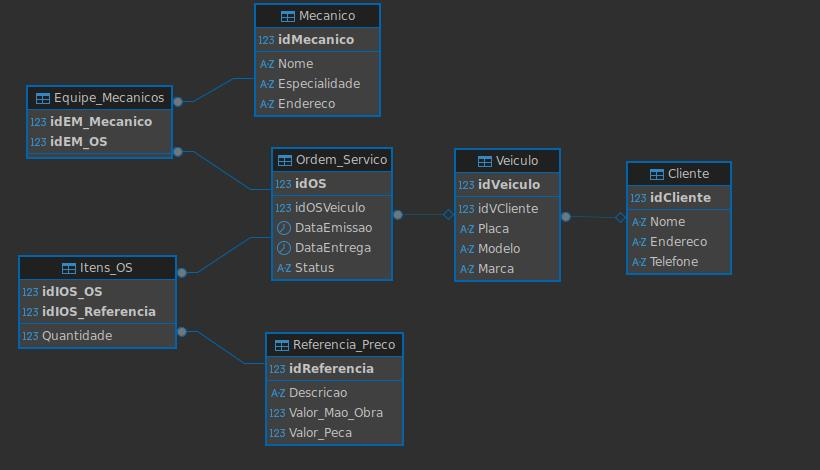

# 🛠️ Oficina Mecânica: Modelagem de Dados

Este repositório contém o projeto lógico de banco de dados para o contexto de uma Oficina Mecânica, desenvolvido para o desafio de projeto da DIO.

## 📋 Escopo do Projeto
O sistema visa gerenciar o fluxo de atendimento de uma oficina, contemplando:
- Cadastro de Clientes e seus Veículos.
- Registro de Mecânicos e suas especialidades.
- Emissão de Ordens de Serviço (OS) com status e datas de entrega.
- Cálculo de valores baseado em uma tabela de referência de serviços e peças.

## 🏗️ Refinamento da Modelagem
Diferente de modelos básicos, este projeto implementa uma tabela de **Equipe de Mecânicos**, permitindo que cada OS seja designada a profissionais específicos, garantindo a rastreabilidade da mão de obra.

## 🚀 Como testar
1. Execute o script `esquema_oficina.sql` para criar a estrutura.
2. Execute o script `dados_oficina.sql` para popular o banco.
3. Utilize o arquivo `queries_oficina.sql` para realizar as consultas analíticas.

## 📐 Modelo EER

